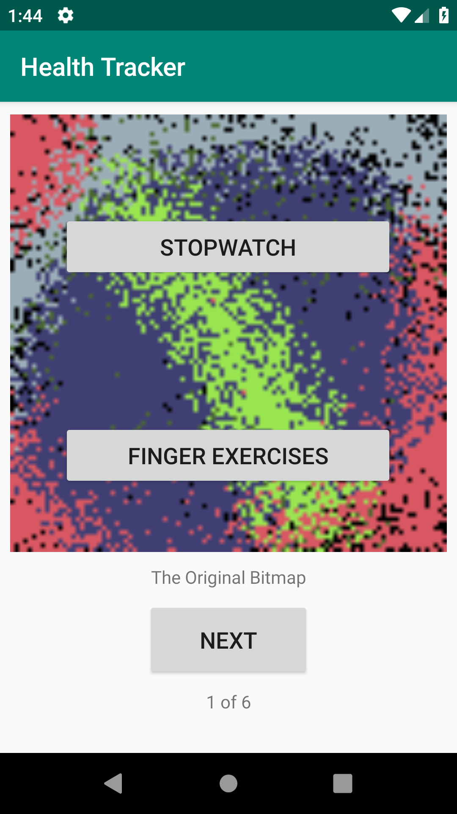
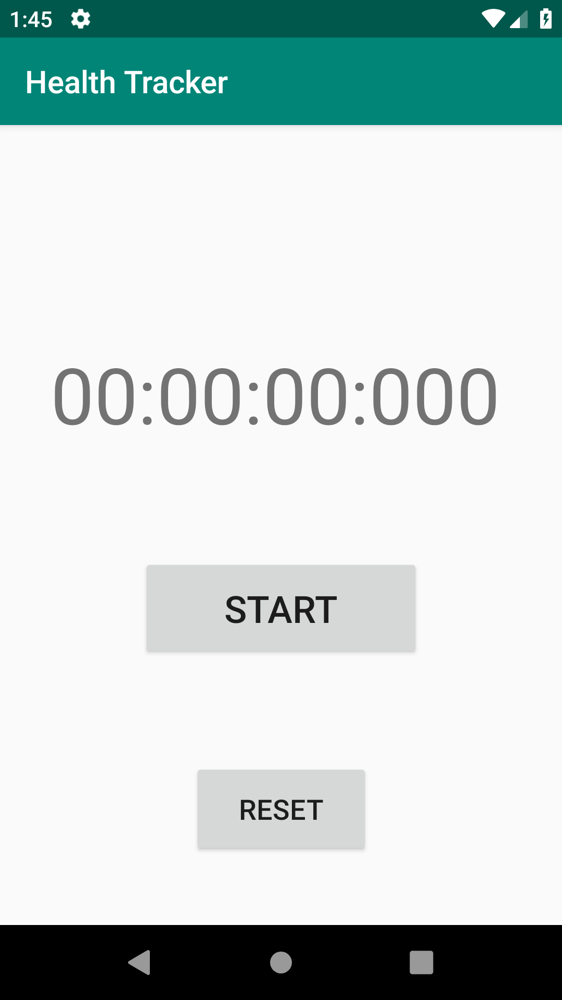
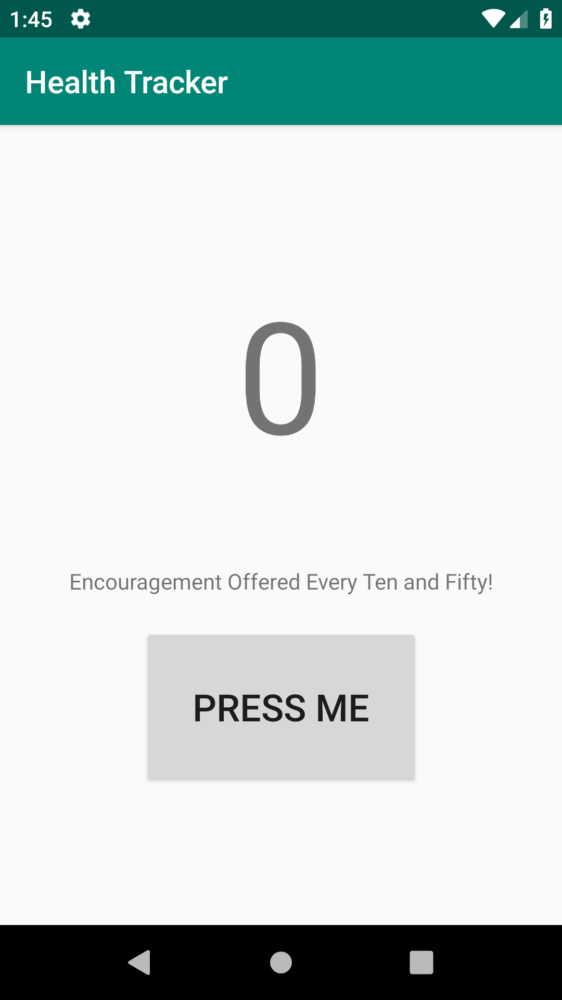
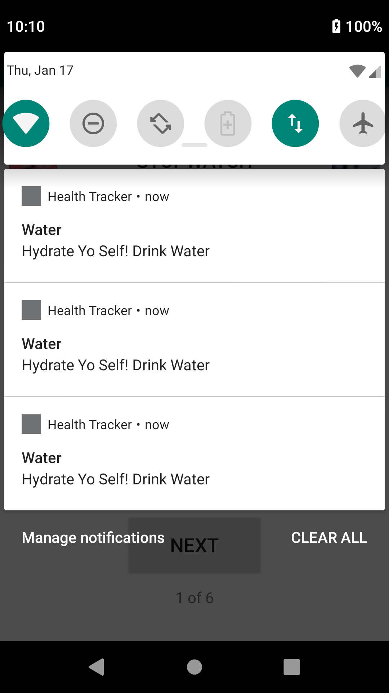

# health tracker

## App Contents

This is an android app that has multiple activities

### Main Activity

This activity consists of an image carousel with a next button to cycle through images.

It also has buttons that will take the user to the other activities.

### Stopwatch Activity

This activity has a stopwatch that counts up to hours with milliseconds as it's smallest denomination of time.

The stopwatch is started and stopped with the start/stop button and reset with the reset button.

It will reset and stop the stopwatch if it is running when reset is hit.

### Finger Exercise Activity

This activity has a counter and a button to increment the counter. It literally just goes up and up, never down.

## Running the App

Open app with android studio, hit run, do the things.

## Images of the Layouts

